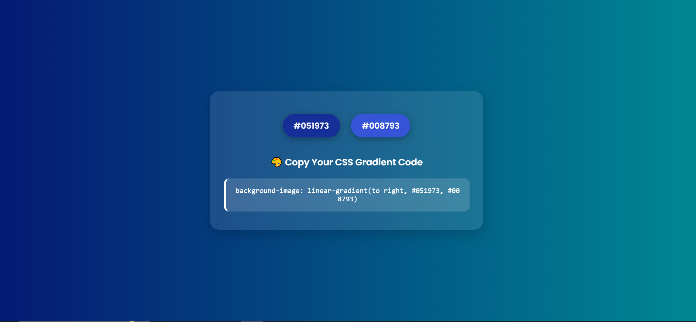

<h1 align="center">🎨 Gradient Selector</h1>

<p align="center">
  <b>A clean and interactive tool to create beautiful CSS linear gradients with just a click.</b><br/>
  Select random colors, preview them live, and copy the CSS gradient code instantly.
</p>

<p align="center">
  
  
  
</p>

---

## ✨ Features

- 🎨 Randomly generate linear gradient backgrounds  
- 🚀 Real-time background updates  
- 📋 One-click CSS code copy  
- 💅 Hover effects with smooth animations  
- 📱 Responsive and visually appealing UI  

---

## 🛠️ Tech Stack

- **HTML5** – Structure of the application  
- **CSS3** – Styling and animations  
- **Vanilla JavaScript** – Core interactivity and logic  

---


## 📸 Screenshot

<p align="center">
  
</p>
## 🧪 How to Use

## 🤝 Contributing

Contributions, issues and feature requests are welcome!

Feel free to fork the repo and create a pull request.


1. Clone the repository:
   ```bash
   git clone https://github.com/manishinit26/Gradient-Selector.git

  
## 🙋‍♂️ Author

**Manish Sharma**  
B.Tech IT Final Year Student  
[GitHub](https://github.com/manishinit26)

---

⭐ If you liked the project, don’t forget to leave a star!
